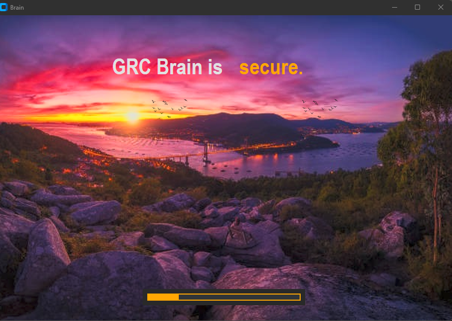
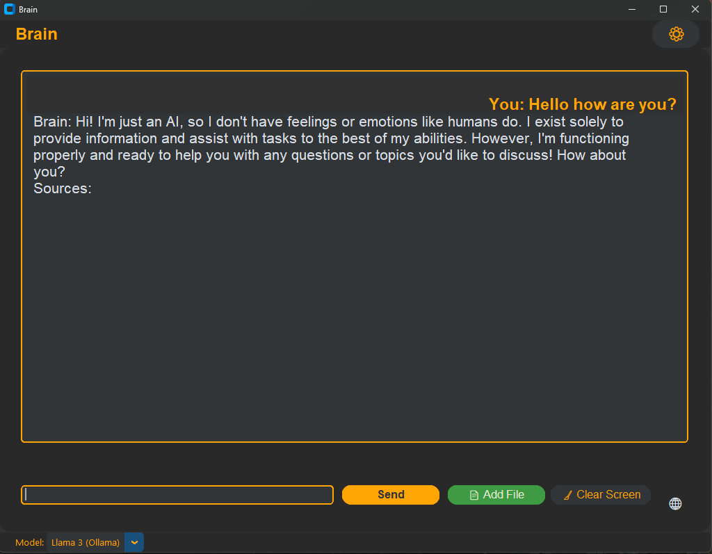

# DsD GRC AI

DsD GRC AI is a desktop application for secure, local management and querying of official GRC (Governance, Risk, and Compliance), cybersecurity, legal, and risk information. It uses local LLMs (Ollama, Llama 3), RAG (ChromaDB), and a modern CustomTkinter GUI inspired by Copilot in VS Code.




## Quick Installation
1. Install Python 3.11 or higher.
2. Install Ollama:
   - Download from: https://ollama.com/download
   - Run the installer and restart your PC.
   - Add `C:\Users\dogso\AppData\Local\Programs\Ollama` to your Windows PATH if `ollama` is not recognized.
   - Open a terminal and run:
     ```
     ollama serve
     ollama pull llama3:8b
     ollama list
     ```
   - Verify that the model `llama3:8b` appears in the list.
3. Install dependencies:
   ```
   pip install -r requirements.txt
   ```
4. Run the application:
   ```
   python main.py
   ```

## Features
- Local AI assistant for GRC, cybersecurity, legal, risk, and compliance queries
- Modern, professional dark GUI (Copilot VS Code style)
- Secure, private, and offline operation
- RAG (Retrieval Augmented Generation) with ChromaDB and official documents
- English only: all information, spellchecking, and resources are in English
- Pagination and result selector for large datasets
- Visual warnings for large queries and documents
- Easy document upload and knowledge expansion

## Architecture
- Clean, modular, hexagonal architecture
- SOLID, DRY, and KISS principles throughout
- Each module is independent and focused on a single responsibility

## Project Structure
- `main.py`: Entry point
- `src/gui/app.py`: Main application window and loader animation
- `src/gui/tabs/chat_tab.py`: Copilot-style chat interface
- `src/ai_core/llm_client.py`: Ollama LLM client
- `src/ai_core/rag_system.py`: RAG integration
- `src/utils/spellcheck_utils.py`: English spellchecking utilities
- `official_docs/`: Preloaded official documents and links (all in English)

## Official Resources
All legal, regulatory, and technical information is preloaded from official sources. See `official_docs/` and `official_docs/official_links.txt` for documents and links. All resources are in English and indicate the country of reference.

## License
This software is Open Source, but commercial use or sale is prohibited. Attribution to DogSoulDev and https://dogsouldev.github.io/Web/ is required.